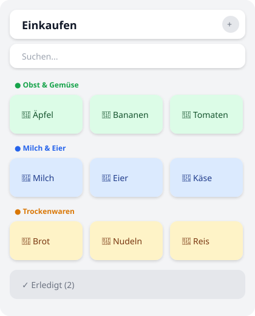

# Shopping List Card

[](https://github.com/hacs/integration)
[](https://github.com/steuerlexi/shopping-list-card/releases)
[](LICENSE)

A Home Assistant Lovelace custom card for managing shopping lists — with a
server-side AppDaemon backend as the single source of truth.

> **v2.0+** replaces HA's native `todo` shopping-list integration with an
> AppDaemon middleware backend (`sensor.einkaufsliste_backend`). The card no
> longer talks to a `todo.*` entity directly. See
> [Migration from v1](#migration-from-v1-todo) if you are upgrading.



---

## How it works

```
┌───────────────┐   events (WS fire_event)   ┌──────────────────────────┐
│  Lovelace     │ ─────────────────────────▶ │  AppDaemon app           │
│  Card (this)  │                            │  einkaufsliste_backend   │
│               │ ◀──── state + attributes ─ │  • persistence (JSON)    │
│  reads sensor │     (items array)          │  • auto-categorize        │
└───────────────┘                            │  • auto-dedup            │
                                             └──────────────────────────┘
```

- The **card** is a pure-JS web component (`shopping-list-card.js`). It reads the
  list from one sensor and fires HA bus events on every user action.
- The **backend** (`apps/einkaufsliste_backend.py`) listens to those events,
  mutates the persistent list, auto-categorizes and de-duplicates, and publishes
  the full list back onto `sensor.einkaufsliste_backend`.
- The **catalog** (`apps/artikel_katalog.json`) is the editable knowledge base:
  categories, article aliases, and OpenMoji icons. Edit it to teach the backend
  new articles — no card edit, no HA restart needed (see
  [Katalog pflegen](#katalog-pflegen)).

---

## Features

- **Tile grid view** — responsive tiles with OpenMoji color-SVG icons
- **Server-side auto-categorization** — Obst & Gemüse, Milchprodukte & Eier,
  Fleisch, Trockenwaren, Getränke, Haushalt & Hygiene, … (shared across all
  devices, persisted)
- **Server-side auto-dedup** — adding "Banane" while "Bananen" is already active
  merges into the existing item (quantity increases) instead of creating a
  duplicate
- **Search bar** with live filter
- **Long-press edit** — hold a tile to change quantity or delete it
- **Collapsible done section** („Erledigt")
- **Removes by uid** — no more "Banane"/"Bananen" confusion like the native
  `todo.remove_item` (which matches by summary string and can't delete completed
  items)
- **Fully themed** with Home Assistant CSS variables, mobile-optimized

---

## Installation

### 1. Card via HACS (recommended)

1. Open HACS → **Frontend** → **Custom repositories**
2. Add `https://github.com/steuerlexi/shopping-list-card` — Category: **Lovelace**
3. Click **Download** on the Shopping List Card entry
4. Refresh your browser cache (Ctrl+Shift+R)

### 2. Backend (AppDaemon) — required

The card is useless without the backend. The backend app lives in the `apps/`
folder of this repo.

1. Install the **AppDaemon** add-on (Settings → Apps → Add-on Store) and start it.
2. Copy these files into the AppDaemon apps directory
   (`/addon_configs/a0d7b954_appdaemon/apps/` on HA OS) — use **Studio Code
   Server** or the AppDaemon add-on's file access (the dir is not on the
   `/config` Samba share):
   - `apps/einkaufsliste_backend.py`
   - `apps/artikel_katalog.json`
3. Append the block from `apps/apps.yaml` to your AppDaemon `apps.yaml` (same dir):
   ```yaml
   einkaufsliste_backend:
     module: einkaufsliste_backend
     class: EinkaufslisteBackend
     # optional: override where einkaufsliste.json is stored
     # data_dir: /config/appdaemon_data/einkaufsliste
   ```
4. Restart the AppDaemon add-on (Settings → Apps → AppDaemon → ⋯ → Restart).
5. Confirm in `appdaemon.log`: `Einkaufsliste backend started (N items,
   catalog …)`. The sensor `sensor.einkaufsliste_backend` now exists.

> Editing `einkaufsliste_backend.py` hot-reloads automatically (AppDaemon watches
> the apps dir). Editing `artikel_katalog.json` takes effect after a
> `einkaufsliste_reload_catalog` event or an AppDaemon restart (see
> [Katalog pflegen](#katalog-pflegen)).

### 3. Add the card to a dashboard

```yaml
type: custom:shopping-list-card
entity: sensor.einkaufsliste_backend
title: "Einkaufen"
```

---

## Configuration

| Name | Type | Default | Description |
|------|------|---------|-------------|
| `entity` | string | **required** | Must be `sensor.einkaufsliste_backend` (the AppDaemon sensor). A `todo.*` entity shows a legacy warning. |
| `title` | string | `"Einkaufen"` | Card title |
| `list` | string | `"standard"` | List key (multi-list support; default list is `standard`) |
| `color` | string | `"#43A047"` | Active-tile accent color (CSS color) |
| `icon_map` | object | `{}` | Per-summary icon override, keyed by article name (HEX code or URL). Takes precedence over the catalog icon. |
| `openmoji_base_url` | string | `https://cdn.jsdelivr.net/npm/openmoji@17.0.0/color/svg` | Base URL for OpenMoji SVG icons |

### Example

```yaml
type: custom:shopping-list-card
entity: sensor.einkaufsliste_backend
title: "Einkaufen"
color: "#2E7D32"
icon_map:
  "Spezialartikel": "1F31F"
```

---

## Katalog pflegen

The catalog `apps/artikel_katalog.json` is the editable knowledge base. It tells
the backend which category and which icon an article belongs to, and which
spellings should be treated as the same article (aliases → auto-dedup).

You edit the JSON **on the HA server** (Studio Code Server or AppDaemon file
access), then fire a reload event — no card change, no HA restart.

### Structure

```json
{
  "version": "2026-07-30",
  "icon_format": "openmoji_hex",
  "icon_url": "https://cdn.jsdelivr.net/npm/openmoji@latest/color/svg/{hex}.svg",
  "categories": [
    {"id": "obst_gemuese", "name": "Obst & Gemüse", "icon": "1F955", "color": "#E67E22"}
  ],
  "artikel": [
    {"name": "Banane", "aliases": ["Bananen"], "category": "obst_gemuese", "icon": "1F34C"}
  ]
}
```

- `categories[].id` — internal key, referenced by `artikel[].category`
- `categories[].icon` / `color` — header icon (OpenMoji HEX) and accent color
- `artikel[].name` — canonical name (this is what the card shows)
- `artikel[].aliases` — other spellings matched case- and umlaut-insensitively
  for **both** auto-categorization and auto-dedup
- `artikel[].icon` — **OpenMoji HEX codepoint** without `0x`, e.g. `1F34C`
- `artikel[].dedup` — optional; set to `false` to opt an article out of
  auto-merge (e.g. you want two separate "Apfel" entries)

The full, authoritative icon mapping table lives in
[`ARTIKEL_ICONS.md`](ARTIKEL_ICONS.md).

### Einen neuen Artikel hinzufügen

1. Open `artikel_katalog.json` (Studio Code Server →
   `/addon_configs/a0d7b954_appdaemon/apps/artikel_katalog.json`).
2. Find the `artikel` array and add an entry:
   ```json
   {"name": "Grünkohl", "aliases": ["Grunkohl"], "category": "obst_gemuese", "icon": "1F96C"}
   ```
   - `category` must match an existing `categories[].id` (see the table in
     `ARTIKEL_ICONS.md`). Unknown categories fall back to `sonstiges`.
   - `aliases` should list plural/alternative spellings so that "Grünkohl" and
     "Grunkohl" both resolve to the same article and merge on add.
3. Save the file.
4. Reload the catalog (see [Nach dem Editieren](#nach-dem-editieren-reload)).

After the reload, adding "Grünkohl" from the card (or via the
`einkaufsliste_add` event) auto-categorizes it into **Obst & Gemüse** with the
chosen icon.

### Passendes Icon vergeben

Icons are **OpenMoji** color SVGs, referenced by their Unicode HEX codepoint
(without `0x`).

- **Find an icon:**
  1. Browse the [OpenMoji library](https://openmoji.org/library/).
  2. Pick an emoji and copy its **HEX code**, e.g. the broccoli emoji 🥦 has
     HEX `1F966`.
  3. Use that code as the `icon` value (lowercase hex is fine): `"icon": "1F966"`.
- **Verify the URL:** the icon resolves to
  `https://cdn.jsdelivr.net/npm/openmoji@latest/color/svg/<HEX>.svg` — open that
  URL in a browser to confirm the SVG exists. If it 404s, the HEX code is wrong.
- **Reference table:** [`ARTIKEL_ICONS.md`](ARTIKEL_ICONS.md) lists the HEX code
  and OpenMoji name for every article and category already in the catalog — use
  it as a quick lookup and as a style reference for new entries.
- **Per-article override without editing the catalog:** set `icon_map` in the
  card config (keyed by article name). This only changes the icon in **that one
  card instance**; editing the catalog changes it for **all** devices.

### Alte / nicht mehr gebrauchte Artikel löschen

There are two things you may want to remove — don't confuse them:

**A. Remove an article from the catalog** (so it won't be auto-categorized anymore):

1. Open `artikel_katalog.json`.
2. Find the entry in the `artikel` array, e.g.
   ```json
   {"name": "Rote Bete", "aliases": ["Rotebete"], "category": "obst_gemuese", "icon": "1F955"}
   ```
3. **Delete the whole object** (including the comma, keeping the JSON valid).
4. Save and reload (see [Nach dem Editieren](#nach-dem-editieren-reload)).

After the reload, the article is no longer recognized — if someone adds it again,
it lands in **Sonstiges** with the default shopping-cart icon `1F6D2`. Existing
items on the list that were already categorized keep their category and icon
(the reload re-categorizes against the catalog, but unknown articles keep their
last-known category/icon).

**B. Remove an article from the actual shopping list** (a one-off delete, not a
catalog change):

- In the card: **long-press the tile → Delete**. This fires
  `einkaufsliste_remove` by uid and removes it from the list (active *or*
  completed).
- Or fire the event manually (Developer Tools → **Events** → Fire Event):
  - Event type: `einkaufsliste_remove`
  - Event data: `{"uid": "<item-uid>"}`

> Never edit `einkaufsliste.json` (the persistent list) by hand — it is
> generated user data. Use the card or the events. Only `artikel_katalog.json`
> is meant for manual editing.

### Nach dem Editieren (Reload)

After changing `artikel_katalog.json`, fire a reload event so the backend picks
up the new catalog and re-categorizes all existing items:

- **Developer Tools → Events → Fire Event**
  - Event type: `einkaufsliste_reload_catalog`
  - Event data: `{}`

The `catalog_version` attribute on `sensor.einkaufsliste_backend` updates, which
also cache-busts the icons in the card.

### Manueller Weg (JSON direkt editieren) — Schritt für Schritt

For users who want the full manual path without the UI:

1. Open **Studio Code Server** (or the AppDaemon add-on's file access / SSH).
2. Open `/addon_configs/a0d7b954_appdaemon/apps/artikel_katalog.json`.
3. Edit the JSON directly — add an object to `artikel`, remove one, or change
   `icon`/`aliases`/`category`. Keep the JSON valid (trailing commas break it).
4. Save.
5. Fire `einkaufsliste_reload_catalog` (Developer Tools → Events → Fire Event,
   data `{}`) — or restart the AppDaemon add-on.
6. Hard-refresh the browser (Ctrl+Shift+R) so the card picks up new icons.

That's it — no card edit, no HA Core restart, no redeploy of the card.

---

## Events (API)

The card fires these via the WebSocket `fire_event` command (HA 2026.x removed
the `homeassistant.fire_event` *service*). You can also fire them from
**Developer Tools → Events** for testing or scripting.

| Event | Payload | Effect |
|-------|---------|--------|
| `einkaufsliste_add` | `{summary, quantity?, list?, no_dedup?}` | Add item; auto-dedup + auto-categorize |
| `einkaufsliste_remove` | `{uid}` | Remove item by uid (active **or** completed) |
| `einkaufsliste_toggle` | `{uid}` | Flip needs_action ↔ completed |
| `einkaufsliste_update` | `{uid, summary?, quantity?, category?, icon?}` | Edit fields (long-press edit) |
| `einkaufsliste_clear_completed` | `{list?}` | Delete all completed items |
| `einkaufsliste_clear_all` | `{list?}` | Empty the (entire / given) list |
| `einkaufsliste_import` | `{from_entity?}` | One-shot migration from a native `todo` entity (default `todo.einkaufsliste`) |
| `einkaufsliste_reload_catalog` | `{}` | Reload `artikel_katalog.json` and re-categorize all items |

### Quick test (Developer Tools → Events)

- **Event type:** `einkaufsliste_add`
- **Event data (JSON):** `{"summary": "Bananen", "quantity": 3}`

Then check `sensor.einkaufsliste_backend` — its `items` attribute contains the
new entry, auto-categorized into **Obst & Gemüse** with icon `1F34C`. Adding
"Banane" afterwards **merges** into the existing item (quantity increases)
rather than creating a duplicate.

---

## Migration from v1 (todo)

If you are moving from the old `todo.einkaufen` / `todo.einkaufsliste` setup:

1. Install the backend (see [Installation](#2-backend-appdaemon--required)).
2. Fire the import event once (Developer Tools → Events → Fire Event):
   - Event type: `einkaufsliste_import`
   - Event data: `{"from_entity": "todo.einkaufsliste"}`
   All existing items are read via `todo.get_items`, auto-categorized, and
   written to the backend's persistent list. Re-running is safe (already-known
   uids are skipped).
3. Repoint your dashboard cards from `entity: todo.einkaufsliste` to
   `entity: sensor.einkaufsliste_backend`.
4. After verifying, disable the old `todo.einkaufsliste` entity.

---

## Tips

- Add items via voice using Assist: "Füge Milch zur Einkaufsliste hinzu" (fires
  `einkaufsliste_add` via a conversation intent).
- The whole list lives in one sensor attribute. Run
  `einkaufsliste_clear_completed` periodically to keep it tidy.
- Auto-dedup only merges into **active** items — adding "Banane" while a
  completed "Bananen" exists creates a new active item (by design, so completed
  items aren't resurrected). Clear completed items first if you want a clean
  merge target.
- After a card update via HACS, hard-refresh the browser (Ctrl+Shift+R) so the
  new `shopping-list-card.js` is loaded.

---

## Troubleshooting

- **„Sensor … nicht gefunden"** in the card: the AppDaemon backend isn't
  running. Check `appdaemon.log` for import errors and restart the add-on. The
  sensor reappears once AppDaemon finishes `initialize()`.
- **Items not categorizing:** the `summary` must match an article `name` or one
  of its `aliases` (case/umlaut-insensitive). Unknown items fall back to
  **Sonstiges** with the shopping-cart icon `1F6D2`. Add the article to the
  catalog (see [Katalog pflegen](#katalog-pflegen)).
- **Dedup not merging:** the dedup matcher compares normalized singular forms;
  very short or irregular plurals may not collapse. Add an alias, or set
  `dedup: false` to force separate entries.
- **Stale tile after deleting a completed item (fixed in v2.0.1):** the card now
  also subscribes to `state_changed` events so attribute-only updates (deletes
  that don't change the active count) are picked up. A hard-refresh
  (Ctrl+Shift+R) always forces a clean rebuild.

---

## License

MIT